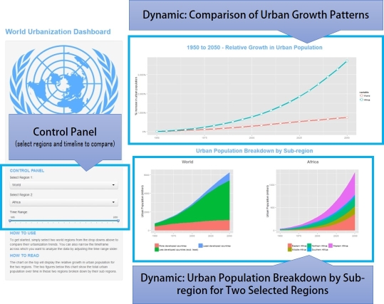

## Purpose and Motivation (Slide 2)

 * The world is rapidly urbanizing, with an additional 2.7 billion people moving to cities between now and 2050.
 * Almost all of this growth will occur in the developing world, as people move in unprecedented numbers from rural areas to pursue their hopes and aspirations in cities.
 * How this transformation unfolds will determine the future health of our cities -- and thereby our planet -- as urban areas already account for 70% of Greenhouse Gas Emissions
 * This makes it essential that we gain a __fact-based understanding of urbanization trends__ so that we can guide our cities on a path of sustainable development

--- .class #id 
## Components (Slide 3)

The World Urbanization Dashboard helps translate an authoritative United Nations urbanization database into helpful insights by enabling users to: (1) Compare urban growth across two global regions; and (2) Explore their urban populations by subregion over time to help uncover which areas account for the surge in urbanization.



--- .class #id
## How to Use (Slide 4)

 1. To get started, simply select two world regions via the drop downs to compare their urbanization trends. 
 2. You can also narrow the timeframe across which you want to analyze the data by adjusting the time range slider.
 3. The chart on the top will display the relative growth in urban population for the two regions. 
 4. The two figures below the main chart show the total urban population over time in these two regions broken down by their sub regions.
 5. Try it now: <a url="http://dennizl.shinyapps.io/urbanization_app">dennizl.shinyapps.io/urbanization_app</a>

--- .class #id
## About the Data: Coverage (Slide 5 - from R Code)

```r
data <- read.csv("un_worldurbanpop_regions_v2.csv", header=TRUE)[,1:2]
regions <- unique(as.character(data$Region)); toPrint <- ""
for(i in 1:length(regions)) {
  subregions <- paste(as.character(data[data$Region == regions[i], ]$Subregion), collapse=", ")
  toPrint <- paste(c(toPrint, regions[i],": ", subregions,"\n"), collapse="")  
}
cat(gsub("All Subregions, ", "",toPrint))
```

```
## World: More developed countries, Less developed countries (excl. least), Least developed countries
## Africa: Eastern Africa, Middle Africa, Northern Africa, Southern Africa, Western Africa
## Asia: Eastern Asia, South-Central Asia, Central Asia, Southern Asia, South-Eastern Asia, Western Asia
## Europe: Eastern Europe, Northern Europe, Southern Europe, Western Europe
## Latin America and the Caribbean: Caribbean, Central America, South America
## Northern America: Canada, Other, United States of America
## Oceania: Australia/New Zealand, Melanesia, Micronesia, Polynesia
```
